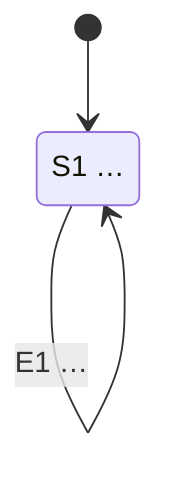

# BUỔI 2 – CHUYỂN TRẠNG THÁI: ĐĂNG NHẬP VÀ KHÓA TÀI KHOẢN

<!-- CHUA_DIEN: xóa dòng này sau khi đã điền xong file -->

- **Họ tên:**
- **MSSV:**
- **Yêu cầu liên quan:** FR-02.1, FR-02.2, FR-02.3, FR-02.4

## 1. Trạng thái và sự kiện

| Ký hiệu | Trạng thái | Mô tả |
|---|---|---|
| S1 | | |
| S2 | | |
| S3 | | |

| Ký hiệu | Sự kiện |
|---|---|
| E1 | |
| E2 | |
| E3 | |

## 2. Sơ đồ chuyển trạng thái

Điền vào khối dưới đây. GitHub sẽ tự vẽ sơ đồ trong Pull Request.

## 3. Bảng chuyển đổi

Điền trạng thái đích cho mọi ô. Ô nào là chuyển đổi bị từ chối hoặc không hợp lệ thì ghi rõ trong cột ghi chú.

| Trạng thái hiện tại | E1 | E2 | E3 | Ghi chú |
|---|---|---|---|---|
| S1 | | | | |
| S2 | | | | |
| S3 | | | | |

## 4. Ánh xạ sang ca kiểm thử

| Chuyển đổi | Hợp lệ? | Mã ca |
|---|---|---|
| | | |
| | | |
| | | |
| | | |
| | | |
| | | |
| | | |
| | | |

Số chuyển đổi hợp lệ: …… · Số chuyển đổi đã phủ: …… · Độ phủ: ……%
Số ca cho chuyển đổi không hợp lệ: ……
