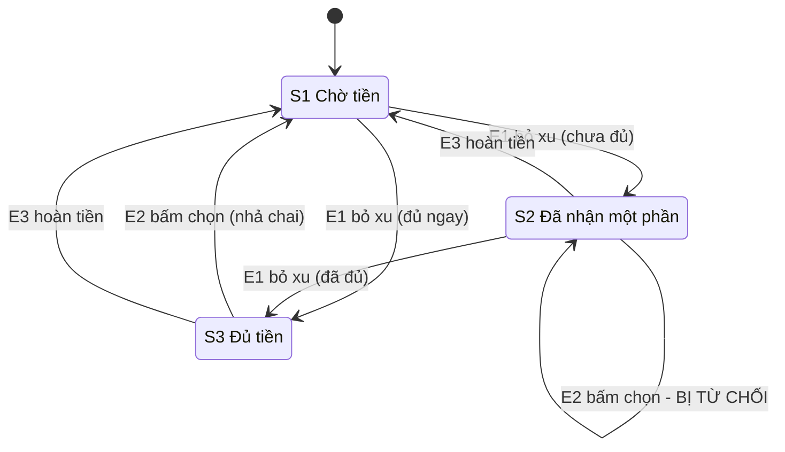

# THỰC HÀNH BUỔI 2
# THIẾT KẾ CA KIỂM THỬ HỘP ĐEN
### Tài liệu hướng dẫn thực hành từng bước

**Học phần:** Kiểm thử phần mềm (SOT357) · **Thời lượng:** 3 giờ · **Hình thức:** Cá nhân
**Liên quan lý thuyết:** Chương 4 – Kỹ thuật thiết kế ca kiểm thử (phần hộp đen)
**Tài liệu gốc:** `docs/SRS-MiniShop-v1.1.md`

---

## CẤU TRÚC TÀI LIỆU

Mỗi phần thực hành được trình bày theo bốn mục, luôn cùng một thứ tự:

| Mục | Nội dung |
|---|---|
| **Cơ sở lý thuyết** | Tóm tắt kỹ thuật trong 5–6 dòng, đủ để thực hiện bài tập |
| **Ví dụ minh họa** | Một bài toán ngoài MiniShop, đã được giải trọn vẹn để tham khảo cách trình bày |
| **Yêu cầu thực hiện** | Phần bài tập phải làm trên MiniShop, kèm quy trình từng bước |
| **Tự kiểm tra trước khi tiếp tục** | Danh mục tự kiểm trước khi chuyển sang phần kế tiếp |

Các ví dụ minh họa sử dụng bài toán ngoài MiniShop (đặt vé xem phim, bãi gửi xe, máy bán nước tự động) nhằm minh họa phương pháp mà không làm lộ đáp án của bài tập.

## Mục tiêu

Sau buổi thực hành, sinh viên có khả năng:

1. Áp dụng **phân hoạch tương đương (EP)** và **phân tích giá trị biên (BVA)** cho dữ liệu đầu vào có miền giá trị.
2. Lập và rút gọn **bảng quyết định** cho nghiệp vụ nhiều điều kiện.
3. Vẽ **sơ đồ chuyển trạng thái** và dẫn ra ca kiểm thử phủ hết chuyển đổi.
4. Viết ca kiểm thử có **kết quả mong đợi kiểm chứng được**.
5. Lập **ma trận truy vết (RTM)** và tự đánh giá độ phủ yêu cầu.

## Chuẩn bị trước buổi học

- [ ] Đọc lại slide Chương 4: EP, BVA, bảng quyết định, chuyển trạng thái
- [ ] Pull Request Buổi 1 đã được duyệt
- [ ] Có tài khoản Google (dùng Google Sheets để soạn CSV)

## Lịch trình

| Thời gian | Nội dung | Số ca |
|---|---|---|
| 0:00 – 0:10 | **Bước 0.** Nhận tài liệu, tạo nhánh, đối chiếu SRS v1.1 | |
| 0:10 – 0:55 | **Phần 1.** Phân hoạch tương đương và giá trị biên | 12–14 |
| 0:55 – 1:35 | **Phần 2.** Bảng quyết định | 8 |
| 1:35 – 1:45 | Nghỉ giải lao | |
| 1:45 – 2:25 | **Phần 3.** Chuyển trạng thái | 8 |
| 2:25 – 2:45 | **Phần 4.** Chạy thử 5 ca và lập RTM | |
| 2:45 – 3:00 | **Phần 5.** Pairwise (về nhà) · Mở Pull Request | |

**Tối thiểu 28 ca.** Phần hoàn thiện được push bổ sung đến 23:59 cùng ngày.

---

# BƯỚC 0. CHUẨN BỊ (10 phút)

## 0.1. Nhận tài liệu mới và tạo nhánh

Mở terminal trong thư mục repo của sinh viên, chạy lần lượt:

```bash
git checkout main
git pull upstream main          # nhận SRS v1.1, đề bài và mẫu bài nộp Buổi 2
git push origin main
git checkout -b buoi-02         # tạo nhánh làm bài
```

Kiểm tra: trong thư mục `bai-nop/` phải thấy 7 file bắt đầu bằng `Buoi02-`.

## 0.2. Đối chiếu SRS v1.1 với phiếu review Buổi 1

Mở `docs/SRS-MiniShop-v1.1.md`, đọc mục **Lịch sử thay đổi** ở đầu tài liệu. Đó chính là danh sách những gì đã được sửa sau buổi review của lớp.

Mở lại phiếu review của mình ở Buổi 1 và trả lời: lỗi nào đã tự phát hiện, lỗi nào bỏ sót, **vì sao** bỏ sót? Ghi 2–3 câu vào mục 0 của `bai-nop/Buoi02-ThucThi-RTM.md`.

> **Từ buổi này trở đi, SRS v1.1 là tài liệu gốc duy nhất.** Mọi kết quả mong đợi phải dẫn được về một mã yêu cầu trong đó. Tuyệt đối **không** suy ra kết quả mong đợi từ hành vi hiện tại của hệ thống — hệ thống có lỗi cài sẵn.

---

# QUY ƯỚC CHUNG (đọc một lần, dùng cho cả buổi)

## Cấu trúc file ca kiểm thử

Bộ ca nộp trong **`bai-nop/Buoi02-TestCase.csv`**, 8 cột:

| Cột | Ý nghĩa | Ví dụ |
|---|---|---|
| `MaCa` | `TC-<MSSV>-<số thứ tự 2 chữ số>` | `TC-64130001-01` |
| `YeuCau` | Mã yêu cầu trong SRS v1.1 | `FR-01.3` |
| `KyThuat` | `EP`, `BVA`, `DT`, `ST` | `BVA` |
| `MucTieu` | Một câu: ca này kiểm tra điều gì | `Tuổi nhập bằng chữ bị từ chối` |
| `TienDieuKien` | Mã `TD1`–`TD5` (bảng dưới) | `TD1` |
| `DuLieuVao` | Chỉ các trường **khác mặc định** | `tuoi=abc` |
| `KetQuaMongDoi` | Kiểm chứng được, dẫn từ SRS | `Không tạo tài khoản; báo lỗi "Tuổi phải là số nguyên"` |
| `DoUuTien` | `Cao`, `TrungBinh`, `Thap` | `Cao` |

## Quy ước viết tắt

**Tiền điều kiện:**

| Mã | Tiền điều kiện |
|---|---|
| `TD1` | Chưa đăng nhập, đang ở màn hình Đăng ký |
| `TD2` | Đã đăng nhập bằng `sv@ntu.edu.vn` (thành viên thường), giỏ hàng trống |
| `TD3` | Đã đăng nhập bằng `vip@ntu.edu.vn` (thành viên VIP), giỏ hàng trống |
| `TD4` | Tài khoản `sv@ntu.edu.vn` ở trạng thái Hoạt động, bộ đếm sai = 0 (vừa khởi động lại server) |
| `TD5` | Tài khoản `sv@ntu.edu.vn` đang bị khóa (vừa sai mật khẩu 3 lần) |

**Dữ liệu vào — chỉ ghi trường khác mặc định:**

| Ngữ cảnh | Mặc định |
|---|---|
| Đăng ký | `hoTen=Nguyen Van A; email=<mã ca>@ntu.edu.vn; tuoi=25; matKhau=Matkhau123` |
| Đăng nhập | `email=sv@ntu.edu.vn; matKhau=Matkhau123` |
| Giỏ hàng | giỏ trống trước mỗi ca |

Ví dụ: ca kiểm tra ô tuổi nhập chữ chỉ cần ghi `DuLieuVao` là `tuoi=abc`.

> Quy ước này **chỉ áp dụng cho `TienDieuKien` và `DuLieuVao`**. Cột `KetQuaMongDoi` vẫn phải viết đầy đủ — đó là phần được chấm kỹ nhất.

## Cách soạn file CSV

1. Tải `bai-nop/Buoi02-TestCase.csv` lên **Google Drive** → mở bằng **Google Sheets**.
2. Điền dữ liệu, giữ nguyên dòng tiêu đề, xóa dòng ví dụ `TC-00000000-00`.
3. **File → Download → Comma-separated values (.csv)**.
4. Chép đè file trong thư mục `bai-nop/`.

> **Lưu ý khi dùng Excel.** Trên Windows cài tiếng Việt, Excel mặc định lưu CSV bằng **dấu chấm phẩy** và mã hóa **ANSI**, làm hỏng toàn bộ dấu tiếng Việt. Nếu dùng Excel, bắt buộc chọn *Save As → **CSV UTF-8 (Comma delimited)*** (khác với mục "CSV (Comma delimited)" thường).
>
> File mẫu đã lưu kèm **BOM UTF-8** nên mở bằng Excel vẫn hiển thị đúng. Chỗ hỏng là lúc **lưu lại**.

## Tự kiểm bất cứ lúc nào

```bash
node scripts/kiem-tra-csv.js
```

Lệnh này kiểm tra hình thức: mã hóa UTF-8, dấu phân cách, mã ca, số ca tối thiểu, JSON, sơ đồ Mermaid, file chưa điền. Nên chạy lệnh này sau **mỗi phần**, không nên đợi đến cuối buổi mới kiểm tra.

---

# PHẦN 1. PHÂN HOẠCH TƯƠNG ĐƯƠNG VÀ GIÁ TRỊ BIÊN (45 phút)

## 1.1. Cơ sở lý thuyết

- **Phân hoạch tương đương (EP):** chia miền dữ liệu thành các **lớp** mà mọi giá trị trong cùng lớp được hệ thống xử lý **như nhau**. Mỗi lớp chỉ cần **một** ca đại diện.
- **Phân tích giá trị biên (BVA):** lỗi hay nằm ở **ranh giới** giữa hai lớp. Với mỗi biên, kiểm 3 giá trị: **ngay dưới – đúng biên – ngay trên**.
- Hai kỹ thuật này **bổ trợ cho nhau**: EP cho biết có bao nhiêu lớp, BVA cho biết giá trị nào đáng kiểm nhất.

## 1.2. Ví dụ minh họa

**Bài toán (không phải MiniShop):** Hệ thống đặt vé xem phim. Yêu cầu **VD-01**: *"Mỗi lần đặt, khách chọn số ghế là số nguyên từ 1 đến 8. Ngoài khoảng này, hệ thống báo lỗi 'Số ghế phải từ 1 đến 8' và không tạo đơn."*

**Bước 1 — Lập bảng phân hoạch:**

| Lớp tương đương | Hợp lệ? | Khoảng giá trị | Giá trị đại diện |
|---|---|---|---|
| Nhỏ hơn 1 | Không | ≤ 0 (gồm cả số âm) | 0 |
| Trong khoảng cho phép | Có | 1 ≤ n ≤ 8 | 1, 8 |
| Lớn hơn 8 | Không | ≥ 9 | 9 |
| Không phải số nguyên | Không | 2.5, "hai" | 2.5 |

**Bước 2 — Xác định biên:** hai biên là 1 và 8 → các giá trị cần kiểm: **0, 1** và **8, 9**. Giá trị 2 và 7 cùng lớp hợp lệ với 1 và 8 nên **không cần ca riêng**.

**Bước 3 — Viết ca kiểm thử** (4 ca BVA + 1 ca EP):

| MaCa | YeuCau | KyThuat | MucTieu | TienDieuKien | DuLieuVao | KetQuaMongDoi | DoUuTien |
|---|---|---|---|---|---|---|---|
| VD-01 | VD-01 | BVA | Số ghế 0 (dưới biên dưới) bị từ chối | Đang ở màn hình đặt vé | soGhe=0 | Không tạo đơn; báo lỗi "Số ghế phải từ 1 đến 8" | Cao |
| VD-02 | VD-01 | BVA | Số ghế 1 (đúng biên dưới) được chấp nhận | Đang ở màn hình đặt vé | soGhe=1 | Tạo đơn thành công với 1 ghế | Cao |
| VD-03 | VD-01 | BVA | Số ghế 8 (đúng biên trên) được chấp nhận | Đang ở màn hình đặt vé | soGhe=8 | Tạo đơn thành công với 8 ghế | TrungBinh |
| VD-04 | VD-01 | BVA | Số ghế 9 (trên biên trên) bị từ chối | Đang ở màn hình đặt vé | soGhe=9 | Không tạo đơn; báo lỗi "Số ghế phải từ 1 đến 8" | TrungBinh |
| VD-05 | VD-01 | EP | Số ghế không phải số nguyên bị từ chối | Đang ở màn hình đặt vé | soGhe=2.5 | Không tạo đơn; báo lỗi số ghế không hợp lệ | Thap |

**Ba nhận xét rút ra từ ví dụ trên:**
1. Kết quả mong đợi ghi **nguyên văn thông báo** lấy từ yêu cầu, không ghi "báo lỗi".
2. Mỗi lớp chỉ **một** ca đại diện — không có ca cho số ghế 3, 5, 6.
3. Ca không hợp lệ chỉ sai **một** yếu tố.

> Ví dụ trên ghi tiền điều kiện bằng lời vì thuộc bài toán khác. Trong bài nộp, tiền điều kiện dùng mã `TD1`–`TD5`, và mã ca phải theo dạng `TC-<MSSV>-<số>` thay cho `VD-xx`.

## 1.3. Yêu cầu thực hiện

Thực hiện với **4 trường dữ liệu** sau của MiniShop, theo đúng ba bước của ví dụ minh họa:

| # | Trường | Yêu cầu | Gợi ý |
|---|---|---|---|
| 1 | Tuổi khi đăng ký | FR-01.3 | Đọc kỹ: biên có **bao gồm** hay không? |
| 2 | Mật khẩu khi đăng ký | FR-01.4 | Yêu cầu này có **hai điều kiện độc lập** — phân hoạch riêng cho từng điều kiện |
| 3 | Số lượng một sản phẩm | FR-03.2 | |
| 4 | Tổng số lượng trong giỏ | FR-03.4 | Mỗi dòng tối đa 99, nên phải ghép nhiều sản phẩm |

**Quy trình cho mỗi trường:**

1. Mở SRS v1.1, đọc **nguyên văn** yêu cầu, gạch chân các con số.
2. Điền bảng phân hoạch vào `bai-nop/Buoi02-PhanHoach.md`.
3. Ghi các giá trị biên cần kiểm (ngay dưới / đúng biên / ngay trên).
4. Viết ca vào `Buoi02-TestCase.csv`, cột `KyThuat` là `EP` hoặc `BVA`.
5. Điền cột `Mã ca` của bảng phân hoạch để nối hai file với nhau.

**Yêu cầu tối thiểu: 12–14 ca.**

Khi SRS chưa quy định rõ một tình huống (ví dụ: nhập ký tự chữ vào ô tuổi thì hệ thống báo lỗi gì), **không được suy đoán**. Hãy ghi lại tại mục **Ghi chú** cuối file `Buoi02-PhanHoach.md`. Đây là câu hỏi cần chuyển lại cho bộ phận phân tích nghiệp vụ, và cũng là nội dung được cộng điểm.

## 1.4. File dữ liệu cho Buổi 3

File **`bai-nop/Buoi02-DuLieuKiemThu.csv`** là phiên bản **máy đọc được** của các ca liên quan đến hàm thuần. Buổi 3 sinh viên sẽ nạp thẳng file này vào Jest, nên nó phải chính xác từng ký tự.

| Cột | Ý nghĩa |
|---|---|
| `MaCa` | Trùng với mã ca trong `Buoi02-TestCase.csv` |
| `Ham` | `validateRegistration`, `validateQuantity` hoặc `calcShippingFee` |
| `ThamSo` | Tham số dạng **JSON một dòng** |
| `KetQuaKyVong` | `HOP_LE` / `KHONG_HOP_LE` với hai hàm đầu; **một con số** với `calcShippingFee` |

Trong Google Sheets sinh viên gõ JSON bình thường vào ô:

```
{"fullName":"Nguyen Van A","email":"a01@ntu.edu.vn","age":30,"password":"Matkhau123"}
```

Google Sheets sẽ tự xử lý phần dấu nháy kép khi xuất CSV.

**Cần ít nhất 15 dòng, có đủ ca của cả ba hàm.** Các dòng cho `calcShippingFee` sẽ được bổ sung ở Phần 2.

## 1.5. Tự kiểm tra trước khi tiếp tục

Chạy `node scripts/kiem-tra-csv.js`. Ở giai đoạn này kết quả **vẫn còn báo lỗi** ở các phần chưa thực hiện (DT, ST, các file Markdown); đó là điều bình thường. Các nội dung cần kiểm tra:

- [ ] Không còn dòng `TC-00000000-00`
- [ ] Không có lỗi về mã hóa hoặc dấu phân cách
- [ ] Không có lỗi "thiếu nội dung cột…"
- [ ] Dòng thống kê hiện `EP + BVA ≥ 12`

**Ba câu hỏi tự rà soát:**
1. Có hai ca nào cùng một lớp tương đương không? (ví dụ tuổi 25 và tuổi 40)
2. Có ca nào sai **hai** yếu tố cùng lúc không?
3. Có ca nào `KetQuaMongDoi` chỉ ghi chung chung không?

## Lỗi thường gặp ở Phần 1

| Lỗi thường gặp | Nguyên nhân | Hướng khắc phục |
|---|---|---|
| Viết 5 ca cho 5 giá trị tuổi hợp lệ khác nhau | Cùng một lớp tương đương, không tăng khả năng bắt lỗi | Giữ 1–2 ca, dùng thời gian cho biên |
| `KetQuaMongDoi` ghi "hệ thống báo lỗi" | Không kiểm chứng được; Buổi 3 không chuyển thành mã kiểm thử được | Ghi nguyên văn thông báo và trạng thái dữ liệu |
| Ca mật khẩu 7 ký tự nhưng dùng luôn mật khẩu chỉ có chữ | Sai hai yếu tố, không biết hệ thống từ chối vì lý do nào | Mỗi ca chỉ sai một yếu tố |
| Lấy kết quả mong đợi từ hành vi thực tế của ứng dụng | Ứng dụng có lỗi cài sẵn | Luôn dẫn chiếu từ SRS v1.1 |

---

# PHẦN 2. BẢNG QUYẾT ĐỊNH (40 phút)

## 2.1. Cơ sở lý thuyết

- Dùng khi kết quả phụ thuộc **nhiều điều kiện kết hợp**.
- Bảng đầy đủ có **2ⁿ luật** với n điều kiện nhị phân. Mỗi cột là một luật.
- **Rút gọn:** nếu một điều kiện **không ảnh hưởng** đến hành động thì đánh dấu *don't care* (`–`) và gộp các luật giống nhau.
- Mỗi luật của bảng **đã rút gọn** cần ít nhất một ca kiểm thử.

## 2.2. Ví dụ minh họa

**Bài toán (không phải MiniShop):** Bãi gửi xe. Yêu cầu **VD-02**: *"Phí gửi xe máy là 5.000đ, ô tô là 30.000đ. Vào ngày cuối tuần, mọi loại xe phụ thu thêm 10.000đ. Thẻ tháng được miễn phí hoàn toàn, kể cả cuối tuần."*

**Bước 1 — Xác định điều kiện và hành động:**

| Ký hiệu | Điều kiện | Giá trị |
|---|---|---|
| C1 | Có thẻ tháng? | Có / Không |
| C2 | Loại xe | Xe máy / Ô tô |
| C3 | Cuối tuần? | Có / Không |

| Ký hiệu | Hành động |
|---|---|
| A1 | Phí phải trả |

Bảng đầy đủ: 2 × 2 × 2 = **8 luật**.

**Bước 2 — Bảng đầy đủ:**

| | L1 | L2 | L3 | L4 | L5 | L6 | L7 | L8 |
|---|---|---|---|---|---|---|---|---|
| **C1** Thẻ tháng | Có | Có | Có | Có | Không | Không | Không | Không |
| **C2** Loại xe | Máy | Máy | Ô tô | Ô tô | Máy | Máy | Ô tô | Ô tô |
| **C3** Cuối tuần | Có | Không | Có | Không | Có | Không | Có | Không |
| **A1** Phí | 0 | 0 | 0 | 0 | 15.000 | 5.000 | 40.000 | 30.000 |

**Bước 3 — Rút gọn:**

| | R1 | R2 | R3 | R4 | R5 |
|---|---|---|---|---|---|
| **C1** Thẻ tháng | Có | Không | Không | Không | Không |
| **C2** Loại xe | – | Máy | Máy | Ô tô | Ô tô |
| **C3** Cuối tuần | – | Có | Không | Có | Không |
| **A1** Phí | 0 | 15.000 | 5.000 | 40.000 | 30.000 |

*Giải thích:* R1 gộp L1–L4 vì thẻ tháng miễn phí **hoàn toàn**, nên loại xe và ngày trong tuần đều là *don't care*. Từ 8 luật còn **5 luật**.

**Bước 4 — Viết ca:** mỗi luật rút gọn một ca, kết quả mong đợi ghi **con số cụ thể**, ví dụ *"Hệ thống hiển thị phí 15.000đ"*, không ghi "tính đúng phí".

## 2.3. Yêu cầu thực hiện

**Nghiệp vụ:** phí vận chuyển và giảm giá khi đặt hàng — **FR-04.1, FR-04.2, FR-04.3, FR-05.2, FR-05.3**.

Điền `bai-nop/Buoi02-BangQuyetDinh.md` theo đúng 4 bước của ví dụ mẫu:

1. **Xác định điều kiện và hành động.** Gợi ý: có **3 điều kiện**, mỗi điều kiện 2 giá trị → 8 luật. Có **3 hành động** (phí vận chuyển, giảm giá, tổng tiền).
2. **Lập bảng đầy đủ 8 luật.** Với mỗi luật, đọc lại SRS và điền từng hành động.
3. **Rút gọn** bằng *don't care*, ghi rõ luật nào gộp với luật nào và **vì sao**.
4. **Viết 8 ca** vào `Buoi02-TestCase.csv` với `KyThuat = DT`, phủ mọi luật rút gọn, cộng ca cho **biên 500.000đ**.

**Chọn dữ liệu — giá sản phẩm trong MiniShop:**

| Sản phẩm | Giá |
|---|---|
| Sổ tay sinh viên | 50.000đ |
| Bình nước giữ nhiệt | 100.000đ |
| Áo thun NTU | 150.000đ |
| Nón bảo hiểm NTU | 200.000đ |
| Balo laptop | 350.000đ |

Từ bảng giá này có thể ghép được các mức tạm tính quanh ngưỡng 500.000đ. Cần xác định: **giá trị nào quanh ngưỡng không thể tạo được qua giao diện?** Ghi nhận xét vào cuối file — đây là một ràng buộc kiểm thử có thật và là nội dung được cộng điểm.

**Hai chi tiết dễ sai, đọc kỹ SRS trước khi điền:**
- FR-04.3: thành viên VIP được miễn phí ở **phạm vi nào**?
- FR-05.3: ngưỡng miễn phí xét theo tạm tính **trước hay sau** khi giảm giá?

**Mỗi ca `DT` phải ghi đủ 4 con số** trong `KetQuaMongDoi`: tạm tính, giảm giá, phí vận chuyển, tổng tiền.

Đồng thời bổ sung các dòng `calcShippingFee` vào `Buoi02-DuLieuKiemThu.csv`, dạng:

```
{"subtotal":450000,"zone":"noi-thanh","customerType":"THUONG"}
```

với `KetQuaKyVong` là **con số phí vận chuyển** (ví dụ `20000`).

## 2.4. Tự kiểm tra trước khi tiếp tục

- [ ] Bảng đầy đủ có đúng 8 cột luật, không cột nào để trống
- [ ] Bảng rút gọn có giải thích việc gộp
- [ ] Mục 4 đã ánh xạ mỗi luật rút gọn sang mã ca cụ thể
- [ ] Chạy `node scripts/kiem-tra-csv.js`, dòng thống kê hiện `DT ≥ 8`

---

# PHẦN 3. CHUYỂN TRẠNG THÁI (40 phút)

## 3.1. Cơ sở lý thuyết

- Dùng khi hệ thống **nhớ** những gì đã xảy ra: cùng một thao tác nhưng kết quả khác nhau tùy trạng thái hiện tại.
- Ba thành phần: **trạng thái**, **sự kiện**, **chuyển đổi** (trạng thái + sự kiện → trạng thái mới).
- Độ phủ tối thiểu: **mọi chuyển đổi hợp lệ** đều có ít nhất một ca.
- Đừng quên **chuyển đổi bị từ chối**: người dùng làm một việc mà hệ thống phải chặn. Lỗi hay nấp ở đây.

## 3.2. Ví dụ minh họa

**Bài toán (không phải MiniShop):** Máy bán nước tự động. Yêu cầu **VD-03**: *"Máy nhận tiền xu, nước giá 10.000đ. Khi đã bỏ đủ tiền, khách bấm nút chọn nước thì máy nhả chai và trở về trạng thái ban đầu. Nếu chưa đủ tiền mà bấm nút, máy báo 'Chưa đủ tiền'. Khách có thể bấm nút Hoàn tiền bất cứ lúc nào để lấy lại tiền đã bỏ."*

**Bước 1 — Liệt kê trạng thái và sự kiện:**

| Ký hiệu | Trạng thái |
|---|---|
| S1 | Chờ tiền (đã nhận 0đ) |
| S2 | Đã nhận một phần (0 < tiền < 10.000đ) |
| S3 | Đủ tiền (≥ 10.000đ) |

| Ký hiệu | Sự kiện |
|---|---|
| E1 | Bỏ xu vào |
| E2 | Bấm nút chọn nước |
| E3 | Bấm nút hoàn tiền |

**Bước 2 — Vẽ sơ đồ bằng Mermaid:**



**Bước 3 — Lập bảng chuyển đổi:**

| Trạng thái | E1 bỏ xu | E2 chọn nước | E3 hoàn tiền |
|---|---|---|---|
| S1 | S2 hoặc S3 | S1 – **từ chối**, báo "Chưa đủ tiền" | S1 – không có tiền để trả |
| S2 | S2 hoặc S3 | S2 – **từ chối**, báo "Chưa đủ tiền" | S1 – trả lại tiền |
| S3 | S3 – nhận thêm | S1 – nhả chai | S1 – trả lại tiền |

**Bước 4 — Viết ca:** mỗi ô trong bảng ít nhất một ca. Ca cho chuyển đổi **bị từ chối** (S1/S2 + E2) quan trọng không kém ca luồng chính.

**Cách mô tả ca có chuỗi thao tác:** cột `DuLieuVao` ghi chuỗi, ví dụ `bỏ 5.000 → bỏ 2.000 → bấm chọn nước`, và `KetQuaMongDoi` phải nói rõ **sau chuỗi đó máy ở trạng thái nào**.

## 3.3. Yêu cầu thực hiện

**Nghiệp vụ:** đăng nhập và khóa tài khoản — **FR-02.1 đến FR-02.4**.

Điền `bai-nop/Buoi02-SoDoTrangThai.md` theo 4 bước của ví dụ mẫu. Gợi ý: **3 trạng thái, 3 sự kiện**.

**Đọc kỹ FR-02.3 và FR-02.4 rồi trả lời trước khi vẽ:**
- Đăng nhập **đúng** khi đang có 2 lần sai thì bộ đếm ra sao?
- Đang bị khóa mà nhập **đúng** mật khẩu thì hệ thống làm gì?
- Sau 15 phút thì trạng thái chuyển về đâu?

Ba câu hỏi này tương ứng với ba chuyển đổi thường bị bỏ sót nhất.

**Yêu cầu 8 ca với `KyThuat = ST`:**
- phủ **100% chuyển đổi hợp lệ** (mỗi chuyển đổi ít nhất 1 ca);
- cộng **ít nhất 2 ca cho chuyển đổi bị từ chối**.

Sơ đồ Mermaid điền vào khối `mermaid` có sẵn trong file — GitHub sẽ tự vẽ trong Pull Request, sinh viên không cần cài phần mềm vẽ.

## 3.4. Tự kiểm tra trước khi tiếp tục

- [ ] Bảng chuyển đổi **không có ô nào để trống** (ô không áp dụng thì ghi rõ)
- [ ] Sơ đồ Mermaid khớp với bảng chuyển đổi
- [ ] Mục 4 ghi rõ độ phủ (số chuyển đổi đã phủ / tổng số)
- [ ] Chạy `node scripts/kiem-tra-csv.js`, dòng thống kê hiện `ST ≥ 8` và không báo lỗi mermaid

---

# PHẦN 4. CHẠY THỬ VÀ MA TRẬN TRUY VẾT (20 phút)

## 4.1. Chạy thử 5 ca ưu tiên Cao

**Chuẩn bị:** mở cửa sổ terminal thứ hai, chạy `npm start`, sau đó truy cập http://localhost:3000.

> **Lưu ý.** Sau mỗi ca làm khóa tài khoản, phải khởi động lại server (`Ctrl + C` rồi `npm start`). Dữ liệu nằm trong bộ nhớ và tài khoản mẫu sẽ không tự mở khóa.

Chọn **5 ca có `DoUuTien = Cao`** trải đều ba kỹ thuật, chạy tay và ghi vào bảng ở mục 1 của `bai-nop/Buoi02-ThucThi-RTM.md`:

| Cột | Cách ghi |
|---|---|
| Kết quả mong đợi | Chép từ `Buoi02-TestCase.csv` |
| Kết quả thực tế | Ghi **đúng những gì sinh viên thấy**, kể cả nguyên văn thông báo |
| Pass/Fail | So hai cột trên |

**Với mỗi ca Fail, trả lời tiếp một câu:** sinh viên tin là **mã nguồn sai**, hay **ca kiểm thử của sinh viên sai**? Căn cứ vào mã yêu cầu nào của SRS v1.1?

Đây là kỹ năng quan trọng nhất của buổi học. Một ca kiểm thử thất bại không đương nhiên có nghĩa là phần mềm sai; nguyên nhân cũng có thể là do hiểu sai yêu cầu.

> Buổi này **chưa viết bug report**. Việc đó làm bài bản ở Buổi 4.

## 4.2. Ma trận truy vết (RTM)

Điền bảng ở mục 2: mỗi yêu cầu được phủ bởi những mã ca nào.

Cách thực hiện nhanh: mở `Buoi02-TestCase.csv` bằng Google Sheets, sắp xếp theo cột `YeuCau`, sau đó gom mã ca theo từng nhóm yêu cầu.

Yêu cầu nào **chưa có ca nào** thì ghi `CHƯA PHỦ` và nêu lý do. Có ba loại lý do, sinh viên hãy phân biệt:
1. **Ngoài phạm vi buổi này** (ví dụ chỉ kiểm được qua API) — chấp nhận được;
2. **Không thuộc ba kỹ thuật hôm nay** — chấp nhận được;
3. **Sinh viên bỏ sót** — cần ghi nhận trung thực, phần này được chấm cao hơn là giấu đi.

## 4.3. Tự đánh giá

Trả lời ba câu hỏi ở mục 3, mỗi câu 2–3 dòng. Câu 3.3 (nếu chỉ được chạy 5 ca thì chọn ca nào) phản ánh tình huống thực tế trong nghề: thời gian kiểm thử luôn ít hơn số ca cần thực thi.

## 4.4. Tự kiểm tra trước khi tiếp tục

- [ ] Bảng chạy thử có đủ 5 dòng, cột "kết quả thực tế" ghi cụ thể
- [ ] Mọi ca Fail đều có dòng phân tích kèm mã yêu cầu
- [ ] RTM không còn ô trống
- [ ] `node scripts/kiem-tra-csv.js` báo **đạt**

---

# PHẦN 5. PAIRWISE — BÀI VỀ NHÀ TỰ CHỌN (+1,0 điểm)

Màn hình **Tìm kiếm và lọc sản phẩm** (sẽ có ở bản MiniShop dùng cho Buổi 4) có 5 tham số:

| Tham số | Các giá trị |
|---|---|
| Từ khóa | rỗng, khớp, không khớp |
| Danh mục | Tất cả, Quà lưu niệm, Đồ dùng học tập |
| Khoảng giá | dưới 100k, 100k–300k, trên 300k |
| Sắp xếp | Giá tăng, Giá giảm, Mới nhất |
| Chỉ còn hàng | Có, Không |

**Các bước:**
1. Tính số tổ hợp đầy đủ (nhân các số giá trị với nhau).
2. Sinh bộ pairwise bằng **PICT** (Microsoft, chạy trên Windows) hoặc công cụ online như *pairwise.teremokgames.com*.
3. Chép bộ ca vào `bai-nop/Buoi02-Pairwise.md`.
4. So sánh số ca và trả lời: pairwise **không** phát hiện được loại lỗi nào?

---

# NỘP BÀI

| Nội dung | Repo | Nhánh | Hạn |
|---|---|---|---|
| Toàn bộ Buổi 2 | `sot357-<MSSV>` | `buoi-02` | **Mở PR** trước khi kết thúc buổi; push bổ sung đến **23:59 cùng ngày** |

```bash
git add bai-nop/
git commit -m "Buoi 2: thiet ke ca kiem thu hop den"
git push -u origin buoi-02
```

Sau đó lên GitHub mở Pull Request, tiêu đề `[Buổi 2] <Họ tên> – <MSSV>`, chọn giảng viên ở mục **Reviewers**. **Không tự Merge.**

File được phép sửa: `bai-nop/Buoi02-*.md`, `bai-nop/Buoi02-*.csv`, `bai-nop/hinh/`.

## Bảng tra lỗi của kiểm tra tự động

| Thông báo | Nguyên nhân | Cách sửa |
|---|---|---|
| *file KHÔNG phải UTF-8* | Lưu bằng Excel dạng ANSI | Mở bằng Google Sheets, tải về dạng *Comma-separated values* |
| *đang dùng dấu CHẤM PHẨY* | Excel trên máy Việt hóa | Như trên |
| *còn dòng ví dụ mẫu* | Chưa xóa dòng `TC-00000000-00` | Xóa dòng đó |
| *MaCa … sai định dạng* | Thiếu MSSV hoặc số thứ tự không đủ 2 chữ số | Sửa thành `TC-<MSSV>-01` |
| *mã ca … bị trùng* | Hai dòng cùng mã | Đánh số lại |
| *mới có N ca …* | Chưa đủ số ca tối thiểu | Bổ sung ca |
| *ThamSo không phải JSON hợp lệ* | Thiếu ngoặc hoặc dấu nháy | Dán JSON vào jsonlint.com để kiểm |
| *mã ca … không có trong Buoi02-TestCase.csv* | Hai file không khớp mã | Đồng bộ lại mã ca |
| *chưa điền xong (CHUA_DIEN)* | Quên xóa dòng đánh dấu | Xóa dòng `<!-- CHUA_DIEN … -->` |
| *sơ đồ mới có N chuyển đổi* | Sơ đồ Mermaid còn sơ sài | Bổ sung cho khớp bảng chuyển đổi |

---

# THANG ĐIỂM (10 điểm)

| Phần | Tiêu chí | Điểm |
|---|---|---|
| 1 | Bảng phân hoạch đủ 4 trường, lớp và biên xác định đúng | 1,0 |
| 1 | Ca EP/BVA: đủ số lượng (≥ 12), phủ biên, không trùng lớp, mỗi ca chỉ sai một yếu tố | 1,5 |
| 1 | `Buoi02-DuLieuKiemThu.csv` đúng cấu trúc, đủ 15 dòng, JSON hợp lệ | 0,5 |
| 2 | Bảng quyết định đầy đủ 8 luật, hành động đúng theo SRS | 1,5 |
| 2 | Rút gọn đúng và giải thích được | 0,5 |
| 2 | 8 ca `DT` phủ hết luật, có ca biên, kết quả mong đợi ghi đủ 4 con số | 1,0 |
| 3 | Sơ đồ Mermaid hiển thị được, đúng trạng thái và sự kiện | 1,0 |
| 3 | Bảng chuyển đổi đầy đủ, chỉ rõ chuyển đổi bị từ chối | 0,5 |
| 3 | 8 ca `ST` phủ 100% chuyển đổi hợp lệ + ≥ 2 ca bị từ chối | 1,0 |
| 4 | Chạy thử 5 ca, ghi kết quả thực tế và lập luận đúng/sai | 0,75 |
| 4 | RTM đầy đủ, chỉ ra được yêu cầu chưa phủ | 0,5 |
| 4 | Tự đánh giá trung thực, có suy nghĩ | 0,25 |
| | **Tổng** | **10** |
| 5 | Pairwise (tự chọn) | **+1,0** |

**Trừ điểm quy trình nộp bài** (tối đa −1,0): giữ nguyên quy định Buổi 1.

> **Tiêu chí xuyên suốt:** ca nào có `KetQuaMongDoi` chung chung, không kiểm chứng được, sẽ **không được tính** vào số ca tối thiểu — dù kiểm tra tự động đã cho qua.
